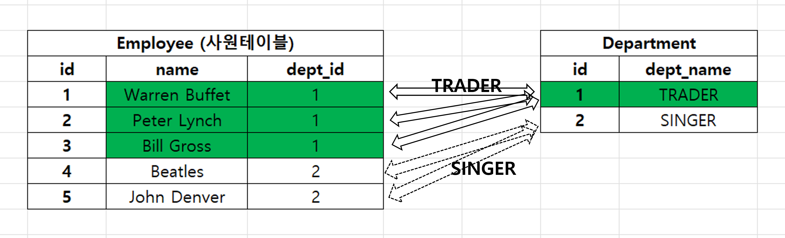

# 1 vs N 단방향
{: .no_toc }
<br>
<br>

## Table of contents
{: .no_toc .text-delta }

1. TOC
{:toc}

---

### 1 vs N 양방향
{: .fs-6 .fw-700 }

양방향을 처음 배울때는 스트레스를 꽤 받는다. 사실은 그냥 코드 보고 테스트 코드 출력결과와 함께 조합해보면 이해가 간다. 
<br>

일하느라 Mybatis, JdbcTemplate 을 헤비하게 쓰다가 까먹을 수 있다는 점도 꽤 문제다. 일하다보면 JPA나 Querydsl 만 쓸수 있지는 않았다. Mybatis 를 쓰거나 JDBCTemplate 을 헤비하게 써야 할때도 있다.<br>

만약 JPA에 대해 까먹은 상태에서 다시 스터디를 시작한다면... 1 vs N 양방향에서는 `mappedBy` 에 어떤 값을 지정하는지만 기억하고 있자. 그러면 언제든지 MyBatis, JdbcTemplate 을 쓰다가도 안 까먹고 다시 기억하고 쓸 수 있다. 이걸 이해했다는 것은 테이블 두개를 같은 키로 매핑할 때와 객체 두개를 같은 키로 매핑할때 왜 다른지를 이해하고 있는 결과가 된다.<br>
<br>

@OneToMany 에 사용하는 `mappedBy` 는 N vs 1 에서 `1` 에 해당하는 측의 매핑을 당하는 필드에 주로 지정한다.<br>
<br>

예를 들어 Employee, Department 객체간의 관계를 보자. Department 입장에서는 여러 명의 Employee 가 존재한다. 따라서 Department 내에는 `List<Employee> employees` 라는 필드가 존재하게 된다. 그리고 이 employees 라는 리스트를 실제 조인이 수행되게끔 하려면 프로그래밍 적으로 별도의 장치가 필요한데, JPA 는 `@OneToMany` 라고 하는 별도의 어노테이션을 사용해서 조인관계를 지정해줄 수 있다.
<br>

이렇게 지정된 Department 클래스 내의 `@OneToMany` 어노테이션에는 `mappedBy` 라는 속성이 있다. 그리고 상대편 테이블인 Employee 클래스에는 `Department dept;` 와 같이 정의해둔 Department 클래스에 대한 참조 점이 있다. Department 클래스 내의 `employees` 에는 상대편 객체인 `Employee` 객체 내의 `dept` 변수에 대해 조인을 수행하게 끔 `mappedBy = "dept"` 라고 지정해준다. 쉽게 이야기하면, 상대편 테이블의 변수명을 지정해주는 방식이다. 내부적으로는 리플렉션을 통해 주입하기 때문이다.
<br>
<br>

여기 까지만 이해하면 1 vs N 의 50% 는 이해했다. 이 외에 N+1 문제도 있고 연관관계 편의 메서드 등 여러가지 이야기들이 있다.
<br>
<br>

### fetch, optional, cascade
{: .fs-6 .fw-700 }

@ManyToOne 에 대해 부가적으로 지정하는 파라미터들.

**fetch**
- @ManyToOne 에 대한 fetch 기본 디폴트 속성은 FetchType.EAGER 이다.
- @OneToMany 에 대한 fetch 기본 디폴트 속성은 FetchType.LAZY 다.
직관적으로 따져보면 Many 에 해당하는 객체가 많기에 Lazy 로딩하도록 지정
<br>

**optional**
- 기본 join 전략을 outer join 으로 할지, inner join 으로 할지에 대한 옵션
- @ManyToOne 에서는 optional = true 가 기본설정이다. 
- optional = true 로 설정하면 left outer join 을 수행하게 된다.
- 참고) optional = false 일때는 inner join 이 실행된다.
<br>

**cascade**
- 영속성 전이에 대한 옵션
- 연관 엔티티를 같이 저장하거나 삭제할 때 사용
<br>
<br>

### e.g. Employee, Department
{: .fs-6 .fw-700 }

시퀀스 채번 전략은 Postgresql 의 규칙으로 했다.
연관관계의 상대편인 DEPT 테이블에 대한 객체인 Department 객체를 FetchType.LAZY로 로딩하도록 설정해두었다.
<br>
양방향 매핑을 하게 되면 코드가 아래와 같아진다.
<br>
<br>

#### Employee.java
{: .fs-5 .fw-700 }

```java
@NoArgsConstructor
@Getter
@Entity
@SequenceGenerator(
    name = "employee_sequence",
    schema = "public", sequenceName = "EMP_SEQ",
    initialValue = 1, allocationSize = 1
)
@Table
public class Employee {
    @Id @GeneratedValue(strategy = GenerationType.SEQUENCE, generator = "employee_sequence")
    @Column(name = "EMPLOYEE_ID")
    private Long id;

    @Column(name = "EMPLOYEE_NAME")
    private String name;

    @ManyToOne(optional = false, fetch = FetchType.LAZY)
    @JoinColumn(name = "DEPT_ID")
    private Department dept;

    @Builder(builderMethodName = "defaultBuilder")
    public Employee(String name, Department dept) {
        this.name = name;
        this.dept = dept;
    }

    public void assignDept(Department dept){
        this.dept = dept;
        dept.getEmployees().add(this);
    }
}
```

<br>
<br>

#### Department.java
{: .fs-5 .fw-700 }

```java
@NoArgsConstructor
@Getter
@Entity
@SequenceGenerator(
    schema = "public",
    sequenceName = "DEPT_SEQ",
    name = "department_seq",
    initialValue = 1,
    allocationSize = 1
)
@Table(name = "DEPARTMENT", schema = "public")
public class Department {

    @Id @GeneratedValue(strategy = GenerationType.SEQUENCE)
    @Column(name = "DEPT_ID")
    private Long id;

    @Column(name = "DEPT_NAME")
    private String deptName;

    @OneToMany(mappedBy = "dept")
    private List<Employee> employees = new ArrayList<>();

    @Builder(builderMethodName = "defaultBuilder")
    public Department(String deptName) {
        this.deptName = deptName;
    }

}
```
<br>
<br>

자세히 보면 Department 클래스의 `employees` 필드에 @OneToMany(mappedBy = "dept") 어노테이션이 적용되어 있다. 이 **"dept"** 는 Employee 클래스 내에서 `private Department dept;` 와 같이 선언되어 있다. 이렇듯 **@OneToMany** 의 mappedBy 에는 지정하는 연관관계의 상대편 클래스에 `List`, `Set` 등의 타입으로 선언된 변수의 변수 명을 정의해준다.
<br>

이렇게 하는 이유는 DB 입장에서는 List 와 같은 선형자료구조로 조인되는 것은 아니지만, 객체 입장에서는 선형 자료구조로 매핑되기 때문에 이렇게 `List`, `Set` 등의 컬렉션에 매핑을 해주게 된다.
<br>
<br>

### 연관관계 편의 메서드
{: .fs-6 .fw-700 }

앞에서 정리한 Employee.java 클래스에는 아래와 같은 코드가 있다.
```java
// ...
@Entity
// ...
public class Employee {

    // ...

    @ManyToOne(optional = false, fetch = FetchType.LAZY)
    @JoinColumn(name = "DEPT_ID")
    private Department dept;

    // ...

    public void assignDept(Department dept){
        this.dept = dept;
        dept.getEmployees().add(this);
    }
}

```
<br>

Department 객체를 받아서 Employee 객체 내의 dept 부서를 변경하고 있다. dept 에 물려있는 Employee 객체에 현재 객체를 추가해줬다. 연관관계의 양측에 대한 관계 세팅을 연관관계의 주인(Employee) 객체에서 수행하게끔 했다.<br>
<br>

이렇게 하면, 코드 상에서 모호함이 발생할 여지가 줄어든다는 장점이 있다.<br>
<br>

#### 연관관계의 주인?
{: .fs-5 .fw-700 }

연관관계의 주인이라는 것은 위의 예제를 예로 들면 `Employee` 클래스가 연관관계의 주인 객체다.
<br>

Employee 객체의 기본키는 `id` 이다. 그리고 Employee 객체는 `dept_id` 라는 컬럼을 `dept` 라는 객체를 소유함으로써 참조하고 있다.<br>
Employee 테이블의 기본키는 `emp_id` 이다. 그리고 Employee 테이블은 `dept_id` 라는 컬럼을 소유하고 있다.<br>

이렇게 조인할 상대편 테이블의 기본키를 외래키처럼 가지고 있는 테이블에 매핑되는 객체를 **연관관계의 주인**이라고 부른다. 쉽게 이야기하면 외래키를 가지고 있는 객체를 연관관계의 주인 객체라고 부른다. 그리고 외래키를 가지고 있는 테이블을 주테이블이라고 부른다.<br>

물론 상용 시스템 DB 운영시에 외래키 참조관계를 제약조건으로 묶어두지는 않는다. 다만, 현재 테이블에서 상대편 테이블의 키를 가지고 있다면 주인 테이블, 그리고 이 주인 테이블을 객체로 매핑한 객체를 **연관관계의 주인 객체** 라고 부른다.
<br>
<br>

#### 테스트 코드 
{: .fs-5 .fw-700 }
```java
@SpringBootTest
@Transactional
public class MappingTestOnlyEmployeeTest {

    @Autowired
    EntityManager em;

    @Test
    @DisplayName("연관관계 편의메서드 테스트")
    public void TEST1(){
        Department deptTrader = Department.defaultBuilder()
                .deptName("TRADER")
                .build();

        Department deptSinger = Department.defaultBuilder()
                .deptName("SINGER")
                .build();

        em.persist(deptTrader);
        em.persist(deptSinger);

        Employee peter = Employee.defaultBuilder().name("Peter Lynch").dept(deptTrader).build();
        Employee buffet = Employee.defaultBuilder().name("Warren Buffet").dept(deptTrader).build();
        Employee beatles = Employee.defaultBuilder().name("Beatles").dept(deptSinger).build();

        em.persist(peter);
        em.persist(buffet);
        em.persist(beatles);

        em.flush();
        System.out.println("Trader 직원 수 : " + deptTrader.getEmployees().size());
        System.out.println("Singer 직원 수 : " + deptSinger.getEmployees().size());
    }
}
```
<br>

**출력결과**
```plain
Trader 직원 수 : 2
Singer 직원 수 : 1
```
<br>
<br>

직원 데이터가 List 에 정상적으로 추가된 것을 볼 수 있다. 만약 이렇게 연관관계의 양측을 수정해주지 않으면 객체의 양측의 데이터가 불일치하는 현상이 발생하기에 가급적 연관관계의 양측을 수정하는 로직은 연관관계 편의 메서드를 사용하게끔 작성해야 한다.
<br>
<br>


### 연관관계 편의 메서드를 사용하지 않으면?
{: .fs-6 .fw-700 }
**!!TODO!!** 예제 정리<br>

코드가 더러워진다. 책임이 명확해지지 않아서 Employee 에서 해당 처리를 할지 Department 에서 관련된 처리를 할지, 클라이언트 로직에서 관련된 처리를 할지 드럽게 애매해진다.
<br>
<br>

나쁘게 사용한 예를 정리하는 예제인데, 문제는 이게 예제를 새로 만들어서 설명을 추가하는데에 시간이 걸리는 만큼 시간이 아깝다는게 문제다. 내일 내지 모레에 시간 날때 추가해둘수 있을 듯 하다.
<br>
<br>


### N+1 문제
{: .fs-6 .fw-700 }

N+1 문제는 별도의 문서에 정리해뒀다.
<br>
<br>

### 양방향 매핑시 객체와 테이블의 차이점
{: .fs-6 .fw-700 }

**테이블간의 매핑**<BR>
서로 다른 두 테이블을 조인하려고 할 때 두 테이블은 공통된 키가 있으면 조인이 가능하다. 테이블을 조인할 때는 단순히 텍스트 값을 통해 서로의 테이블에서 키가 일치하는지를 검사하는 것으로 조인한 결과를 가져올 수 있다.<br>


<br>
<br>

**객체간의 매핑**<br>
테이블의 매핑관계에 비해서는 조금 복잡해진다. 객체를 양방향으로 연결하려면 객체 양쪽에서 서로를 연결해야 한다. 위에서 살펴본 테이블의 매핑에서는 외래키와 상대편 테이블의 기본킷값을 단순 텍스트로 비교하게끔 sql을 작성하기만 하면 됐었다.<br>

객체는 객체 안의 List 또는 Set 에 상대편 테이블의 데이터들을 담아둬야 한다는 점에서 테이블간의 매핑과 다르고, 조금은 오묘하다. <br>

(아마 sql 을 해석하는 데이터베이스 엔진에서는 select 쿼리 호출시 조인이 있을 때 이런 비슷한 처리를 하지 않을까 하고 상상해본적은 있다.)<br>

예를 들면 아래와 같은 구조로 객체 안에 같은 키에 대한 상대편 테이블의 데이터가 말려들어가게 된다. 이런 구조를 JPA 기반으로 행 데이터 추가/수정 시에는 연관관계 편의 메서드로 구현해주면 된다.<br>

```javascript
var traders = {
    "id": 1,
    "employeeList" : [
        {"id" : 1, "name": "Warren Buffet", "dept_id": 1},
        {"id" : 2, "name": "Peter Lynch", "dept_id": 1},
        {"id" : 3, "name": "Bill Gross", "dept_id": 1}
    ]
};

val singers = {
    "id": 2,
    "employeeList": [
        {"id" : 4, "name": "Beatles", "dept_id": 2},
        {"id" : 5, "name": "John Denver", "dept_id": 2},
    ]
}
```
<br>
<br>

### mappedBy
{: .fs-6 .fw-700 }

아쉽게도 JPA 에서는 연관관계의 주인 또는 주인 테이블을 명확히 표시하는 키워드는 없다. 다만, mappedBy 라는 키워드를 통해 주인테이블의 상대편을 암묵적으로 확인할 수 있다.<br>

머리로 이해해야 쉽고, 글로 정리할 수록 어려워지는게 엔티티매핑이라고 개인적으로 생각하는데, 그래도 일단은 요약해보면 아래와 같다.
<br>
<br>

**연관관계의 주인 테이블 매핑 객체**
- mappedBy 키워드는 없다.
- 외래키를 가지고 있는 테이블을 표현하는 객체다.
- e.g. Employee 테이블/객체는 dept_id 라는 Department 의 id를 가지고 있는다.
- 상대편 테이블에서 mappedBy 키워드를 통해 이 객체의 변수 명을 참조한다.
<br>

**연관관계의 주인의 상대편 테이블 매핑 객체**
- mappedBy 키워드를 가지고 있다.
- mappedBy 에는 주인 테이블에서 선언한 변수 명을 텍스트로 지정해준다. (JPA는 쿼리 수행시 이것을 리플렉션을 통해 이 변수 명에 해당 정보를 바인딩해준다.)
- e.g. Department 클래스 내의 `@OneToMany(mappedBy = "dept")` 은 'dept 는 Employee 내의 `Department dept;` 라는 변수다. 
<br>
<br>
