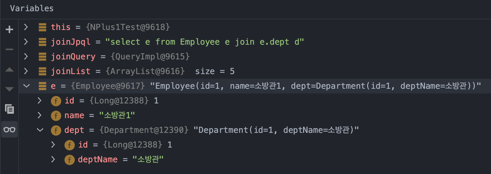

# N+1 문제
{: .no_toc }

JPA 를 사용할 때 N+1 문제를 해결할 수 있는 방법을 요약해보면 아래와 같다.

- JDBCTemplate 을 사용한다. 
- JPQL을 사용한다. (영속성캐시를 거치지 않고 바로 조회)
- @EntityGraph 를 사용한다.
- Querydsl 을 사용한다면 fetchJoin() 을 사용한다.
<br>
<br>

N+1 은 fetchType.LAZY 와도 연관되어있다.<br>
그래서 N+1 개념을 엔티티매핑에 정리할지 혼란이 오기도 하는 것 같다.<br>
<br>

흔히 사용되는 1vsN 매핑은 주로 OneToMany 매핑으로 매핑한다.  OneToMany 는 가급적 FetchType 을 LAZY로 지정하는 것이 권장된다. 그래야 원하는 상황(연관관계 양측을 모두 로딩해야하는 상황)에만 fetch Join 등을 사용해서 데이터를 조인으로 가져오고 그 외의 상황(한쪽의 데이터만 필요한 상황)에는 단순 select 만 사용하도록 묵시적으로 사용할 수 있기 때문이다.
<br>
<br>

묵시적으로는 느슨한 쿼리(조인을 사용하지 않는 쿼리)를 사용하고 필요한 상황에 맞춰 조인을 걸어서 조회하는 것이 FetchType.LAZY 의 목적인데, 이 FetchType.LAZY 에 대한 쿼리는 반드시 위에서 정리한 4가지 해결책 중 한가지를 통해야 n+1 문제를 피해서 조인쿼리 한번에 다수의 데이터를 조회해올 수 있다.
<br>
<br>

이렇게 하는 이유는 데이터 조회의 부하를 피하기 위해서다.
<br>
<br>


## Table of contents
{: .no_toc .text-delta }

1. TOC
{:toc}

---

<br>

### 참고자료
{: .fs-6 .fw-700 }
[인프런 - 실전! Querydsl](https://www.inflearn.com/course/querydsl-%EC%8B%A4%EC%A0%84)
<br>
<br>


### N+1 이란?
{: .fs-6 .fw-700 }

쉽게 설명하자면 아래와 같다.
- 사원 객체 n개에 대한 사원 리스트 조회 1회 + n명의 각 사원에 대한 부서명 조회 n회 = N+1 회의 쿼리가 발생하는 현상
<br>
<br>

### 대표적인 해결방법들
{: .fs-6 .fw-700 }

- JDBCTemplate 을 사용한다. 
- JPQL을 사용한다. (영속성캐시를 거치지 않고 바로 조회)
- @EntityGraph 를 사용한다.
- Querydsl 을 사용한다면 fetchJoin() 을 사용한다.

<br>
<br>

### 예제 엔티티매핑(Employee, Department)
{: .fs-6 .fw-700 }

Employee, Department 라는 이름의 엔티티가 있다고 해보자. 이 Employee 와 Department의 참조관계는 아래와 같다.
<br>
시퀀스 채번 전략은 Postgresql 기준이다.
<br>


<br>
<br>

#### Employee.java
{: .fs-5 .fw-700 }

연관관계의 상대편인 DEPT 테이블에 대한 객체인 Department 객체를 FetchType.LAZY로 로딩하도록 설정해두었다.

```java
package io.study.jpa.generation_strategy.company.employee;

// ...

@Getter
@Entity
@SequenceGenerator(
    name = "employee_sequence",
    schema = "public", sequenceName = "EMP_SEQ",
    initialValue = 1, allocationSize = 1
)
@Table(name = "EMP", schema = "public")
public class Employee {

    @Id @GeneratedValue(strategy = GenerationType.SEQUENCE, generator = "employee_sequence")
    @Column(name = "EMPLOYEE_ID")
    private Long id;

    @Column(name = "EMPLOYEE_NAME")
    private String name;

    @ManyToOne(optional = false, fetch = FetchType.LAZY)
    @JoinColumn(name = "DEPT_ID")
    private Department dept;

    public Employee(String name, Department dept){
        this.name = name;
        this.dept = dept;
    }
}
```

<br>
<br>

#### Department.java
{: .fs-5 .fw-700 }

```java
package io.study.jpa.generation_strategy.company.department;

// ...

@Entity
@SequenceGenerator(
    schema = "public", sequenceName = "DEPT_SEQ", name = "department_seq",
    initialValue = 1, allocationSize = 1
)
@Table(name = "DEPT", schema = "public")
public class Department {

    @Id @GeneratedValue(strategy = GenerationType.SEQUENCE, generator = "department_seq")
    @Column(name = "DEPT_ID")
    private Long id;

    @Column(name = "DEPT_NAME")
    private String deptName;

//    @OneToMany(mappedBy = "dept")
//    List<Employee> employees = new ArrayList<>();

    public Department(String deptName){
        this.deptName = deptName;
    }
}
```
<br>
<br>


### N+1 해결예제
{: .fs-6 .fw-700 }

#### 1\) JDBCTemplate (예제 추가 필요)
{: .fs-5 .fw-700 }
**!!TODO!! 토요일 오전 중 테스트 예제 추가 예정**
<br>
<br>

#### 2\) JPQL 의 fetch join 
{: .fs-5 .fw-700 }
사원 리스트를 한번 불러올 때 JPQL의 fetch join 을 사용하면, 영속성 컨텍스트(=엔티티 저장소) 내의 부서명에 대한 엔티티 버전과 값들도 업데이트 하게 된다.<br>

```java
@Test
@DisplayName("페치조인을_활용한_조회테스트")
public void 페치조인을_활용한_조회테스트(){
  em.clear();
  String joinFetchJpql = "select e from Employee e join fetch e.dept d";
  TypedQuery<Employee> joinFetchQuery = em.createQuery(joinFetchJpql, Employee.class);
  List<Employee> joinFetchResultList = joinFetchQuery.getResultList();

  for(Employee e : joinFetchResultList){
    System.out.println(e.getName() + " 의 부서 : " + e.getDept().getDeptName());
  }
}
```
<br>
<br>

디버그 모드를 통해 데이터를 보면 아래와 같이 사원 정보 각각에 대해 부서정보가 바인딩되어 있는 것을 볼 수 있다.

<br>
<br>

SQL도 확인해보면, 조인 한번에 사원정보에 부서정보를 각각 바인딩해주는 것을 확인 가능하다.
```sql
Hibernate: 
	select
			employee0_.employee_id as employee1_1_0_,
			department1_.dept_id as dept_id1_0_1_,
			employee0_.dept_id as dept_id3_1_0_,
			employee0_.employee_name as employee2_1_0_,
			department1_.dept_name as dept_nam2_0_1_ 
	from
			public.emp employee0_ 
	inner join
			public.dept department1_ 
		on employee0_.dept_id=department1_.dept_id
```
<br>
<br>

#### 3\) @EntityGraph
{: .fs-5 .fw-700 }
추천되는 편은 아니다. SQL 조회구문이 복잡해질 경우에는 사용할 수 없기 때문이다.
**EmployeeRepository.java**<br>
- EmployeeRepository 내에 아래와 같이 코드를 추가해주자.

```java
public interface EmployeeRepository extends JpaRepository<Employee, Long> {

	@EntityGraph(attributePaths = {"dept"})
	@Query("select e from Employee e join e.dept d")
	public List<Employee> findAllUsingEntityGraph();
}
```
<br>

**생성된 SQL**<br>
SQL이 아래와 같이 한번만 수행되는 것을 확인가능하다.

```sql
Hibernate: 
	select
		employee0_.employee_id as employee1_1_0_,
		department1_.dept_id as dept_id1_0_1_,
		employee0_.dept_id as dept_id3_1_0_,
		employee0_.employee_name as employee2_1_0_,
		department1_.dept_name as dept_nam2_0_1_ 
	from
		public.emp employee0_ 
	inner join
		public.dept department1_ 
		on employee0_.dept_id=department1_.dept_id
```

<br>
<br>

#### 4\) Querydsl 의 fetch join (예제 추가 필요)
{: .fs-5 .fw-700 }
**!!TODO!! 토요일 오전 중 테스트 예제 추가 예정**
<br>
<br>

### N+1 문제가 발생하는 예제
{: .fs-6 .fw-700 }
예제로 사용할 데이터는 이런 모습이다.

<br>
<br>

#### 조금은 단순무식한 케이스
{: .fs-5 .fw-700 }
N+1 을 흉내내기 위해 조금은 이상한 예제를 만들였다.

```java
@Test
@DisplayName("N_Plus_1_조회테스트")
public void N_Plus_1_조회테스트(){
  em.clear();
  List<Employee> list = repository.findAll();

  for(Employee e : list){
    String deptName = e.getDept().getDeptName();
    System.out.println(e.getName() + "의 소속부서 : " + deptName);
  }
}
```
<br>
<br>

#### findAll() 쿼리 + 개별 select 1회 x N
{: .fs-5 .fw-700 }

아래의 쿼리에서는 select all 이 1회 발생한다.
```java
em.clear();
List<Employee> list = repository.findAll();
```
<br>

이유는 Department 객체에 FetchType 을 FetchType.LAZY 로 지정해뒀기 때문이다. 

> OneToMany 는 가급적 FetchType 을 LAZY로 지정하는 것이 권장된다. 그래야 원하는 상황에만 fetch Join 등을 사용해서 데이터를 조인으로 가져오고 그 외의 상황에는 단순 selectAll 만하도록 지정할 수 있기 때문이다.
<br>

그런데 위의 상황에서 개별 사원 각각에 대한 부서 정보를 건건이 하나씩 불어온다면?
```java
  // ...
  List<Employee> list = repository.findAll();
  // ...

  for(Employee e : list){
    String deptName = e.getDept().getDeptName();
    System.out.println(e.getName() + "의 소속부서 : " + deptName);
  }
```

(개별사원에 대한 부서 조회 1 회 x N) + 전체사원 조회 1회 = N+1 현상이 발생했다.
<br>
<br>

### N+1 발생케이스 (1) - FetchType.EAGER
{: .fs-6 .fw-700 }

결론만 말하자면, FetchType.EAGER로 설정하더라도 N+1 상황에서는 N+1 문제가 발생한다.
<br>
- 사원 리스트 조회 SQL 1회 + 부서 단건 조회 n회 = n+1 회

<br>
디버그 모드에서는 개별바인딩이 잘 된 것으로 보이지만, SQL 출력결과를 보면 부서 정보 단건조회를 N회 수행되어 버린다.
<br>

Employee.java 를 아래와 같이 수정해주자.
```java
@Entity
// ...
public class Employee {

	// ...

    @ManyToOne(optional = false, fetch = FetchType.EAGER)
    @JoinColumn(name = "DEPT_ID")
    private Department dept;

    public Employee(){}

	// ...
}
```

디버깅 모드로 Employee 의 리스트를 조회할 때에는 아래와 같이 Department 객체에 정보가 각각 세팅되어 있는 것을 확인 가능하다. <br>

디버그 화면 상으로는 n+1 문제가 해결된 것 같다.


하지만, Employee 객체 내의 Department 를 조회하려고 하면 SQL이 개별건으로 또 호출되게 되는 현상이 발생한다.<br>
생성된 QUERY 를 보면 여전히 N+1 sql이 발생함을 볼 수 있다.

```sql
# repository.findAll();
Hibernate: 
		select
            employee0_.employee_id as employee1_1_,
            employee0_.dept_id as dept_id3_1_,
            employee0_.employee_name as employee2_1_ 
        from
            public.emp employee0_ 
        inner join
            public.dept department1_ 
                on employee0_.dept_id=department1_.dept_id

# for 문 내에서 Department 객체 개별 조회 시작
Hibernate: 
    select
        department0_.dept_id as dept_id1_0_0_,
        department0_.dept_name as dept_nam2_0_0_ 
    from
        public.dept department0_ 
    where
        department0_.dept_id=?
Hibernate: 
    select
        department0_.dept_id as dept_id1_0_0_,
        department0_.dept_name as dept_nam2_0_0_ 
    from
        public.dept department0_ 
    where
        department0_.dept_id=?
// ...
```

### N+1 발생케이스 (2) - Join, Inner Join 
{: .fs-6 .fw-700 }

Join, 또는 inner join 등으로 조인을 하더라도 N+1이 발생한다.

```java
@Test
@DisplayName("일반조인을_활용한_조회테스트")
public void 일반조인을_활용한_조회테스트(){
  em.clear();
  String joinJpql = "select e from Employee e join e.dept d";
  TypedQuery<Employee> joinQuery = em.createQuery(joinJpql, Employee.class);
  List<Employee> joinList = joinQuery.getResultList();

  for(Employee e : joinList){
    System.out.println(e.getName());
  }
}
```
<br>

아래는 for