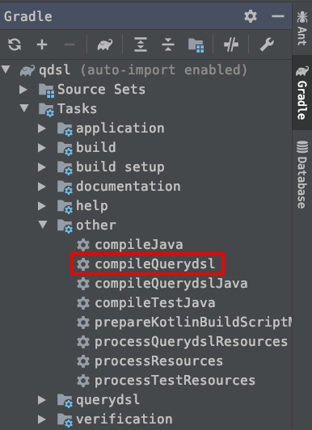
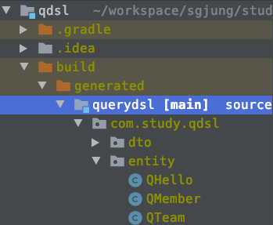

# Querydsl 빠르게 훑어보기
{: .no_toc }

## Table of contents
{: .no_toc .text-delta }

1. TOC
{:toc}

---

<br>

### 참고자료
{: .fs-6 .fw-700 }
[인프런 - 실전! Querydsl](https://www.inflearn.com/course/querydsl-%EC%8B%A4%EC%A0%84)
<br>
<br>


### QType 생성
{: .fs-6 .fw-700 }
Querydsl 빌드는 보통 아래 그림처럼 `compileQuerydsl` 같은 태스크를 정의해서 사용하는 편이다.<br>


위 빌드를 수행하고 나서 QType이 생성된 모습은 아래와 같다.


그림에서 보이듯 `@Entity` 가 붙은 모든 클래스 들에 대해 `QMember`, `QTeam` 처럼 Q가 앞에 붙은 쿼리를 위한 클래스 타입들이 새로 generated 디렉터리에 생성된 것을 확인할 수 있다.
<br>
<br>


### 기본 엔티티 매핑
{: .fs-6 .fw-700 }
흔히 처음 ORM을 공부할때 자주 연습해보는 Member, Team 의 기본적인 엔티티 매핑 예제다.
연관관계는 1:N이다.

Member.java
```java
@Entity
@Getter @Setter
@NoArgsConstructor(access = AccessLevel.PROTECTED)
public class Member{
  @Id @GeneratedValue
  @Column(name="member_id")
  private Long id;
  private String username;
  private int age;
  
  @ManyToOne(fetch=FetchType.LAZY)
  @JoinColumn(name="team_id")
  private Team team;
  
  public Member(String name, int age, Team team){
    this.username = username;
    this.age = age;
    if(team != null){
      changeTeam(team);
    }
  }
}
```
<br>
<br>

Team.java
```java
@Entity
@Getter @Setter
@NoArgsConstructor(access = AccessLevel.PROTECTED)
@ToString(of={"id", "username", "age"})
public class Team{
  
  @Id @GeneratedValue
  private Long id;
  private String name;
  
  @OneToMany(mappedBy="team") 
  private List<Member> members = new ArrayList<>();
  
  public Team(String name){
    this.name = name;
  }
}
```
<br>
<br>

### Querydsl 로 쿼리를 작성하고 한번 구동해보기
{: .fs-6 .fw-700 }

테스트 코드에서 돌려보자. 
Spring Boot 내에서 구동했다.

```java
@SpringBootTest
@Transactional
public class QueryDslTest{
  @Autowired
  EntityManager em;
  
  JPAQueryFactory queryFactory;
  
  // 샘플 데이터 생성
	@BeforeEach
	public void init(){
		queryFactory = new JPAQueryFactory(em);
		Team analysisTeam = new Team("Analysis");

		entityManager.persist(analysisTeam);

		Member john = new Member("John", 23, analysisTeam);
		Member susan = new Member("Becky", 22, analysisTeam);

		entityManager.persist(john);
		entityManager.persist(susan);
	}
  
  	@Test
	public void selectAll(){
		List<Member> members = queryFactory.select(member)
			.from(member)
			.fetch();

		for(Member m : members){
			System.out.println( " member :: " + m);
		}
	}
}
```
<br>

Querydsl 은 아래와 같이 select 를 한다.
```java
List<Member> members = queryFactory.select(QMember.member)
  .from(QMember.member)
  .fetch();
```
<br>
<br>

### `Select ... From Table1 t1 ...` 형태의 테이블 별칭 사용해보기
{: .fs-6 .fw-700 }

QType 의 생성자 내에 문자열을 입력해주면, 이것을 테이블의 별칭으로 사용한다.

```java
@Test
public void startQueryDsl(){
  // 여기서 테이블의 별칭을 지정했다.
  QMember m1 = new QMemeber("m1");
  
  Member findMember = queryFactory
    .select(m1)
    .from(m1)
    .where(m1.username.eq("member1"))
    .fetchOne();
  
  assertThat(findMember.getUsername()).isEqualTo("member1");
}
```
<br>
<br>

### `where` 구문 작성해보기
{: .fs-6 .fw-700 }

`and()`, `or()` 등 과 같은 Builder 유형의 객체들을 통해 다양한 검색조건들을 조합할 수 있다.

```java
// ...
@Test
public void search(){
  QMember member = QMember.member;

  Member selectedMember = queryFactory.select(member)
    .from(member)
    .where(
    member.username.eq("Mybatis")
    .and(member.age.between(30, 40))
  )
    .fetchOne();

  assertThat(selectedMember.getUsername()).isEqualTo("Mybatis");
}
// ...
```
<br>


**e.g. 멤버들 중 이름이 Alex 이면서, 나이가 35인 멤버 찾기**<br>
BooleanExpression 을 반환하는 함수를 여러개 나열하는 방식
```java
// ...
@Test
public void searchAndParam(){
  final QMember member = QMember.member;

  Member memberResult = queryFactory.selectFrom(member)
    .where(
    member.username.eq("Alex"),
    member.age.eq(35)
  )
    .fetchOne();

  assertThat(memberResult.getUsername()).isEqualTo("Alex");
}
// ...
```
<br>


### fetch() - 결과조회
{: .fs-6 .fw-700 }

select() 로 얻어온 JPAQuery\<T\> 를 from(), where(), join() 등의 구문을 계속 이어가면서 쿼리를 만들어내는데, 모두 만들어진 SQL 구문뒤에  `fetch()` 메서드를 호출하면, 결과값을 반환하게 된다.<br>
<br>

**e.g. 1) fetch() 를 호출하지 않은 경우 - `JPAQuery<T>` 를 반환한다.**
```java
JPAQuery<Member> queryContext = 
  	queryFactory
  		.select(...)			// 얻어온 Entity 들 중에서 어떤 컬럼(필드)을 보일지 기술
  		.from(...)				// Entity 에서 얻어온다.
  		.where(...)				// 어떤 Entity에서 데이터를 가져올지 기술
  		.join(...)				// join을 어떤 Entity와 할지 기술
```
<br>
<br>

**e.g. 2) fetch() 호출하기**
```java
List<Member> results = queryContext.fetch();
```
<br>
<br>


**e.g. 3) 모든 조건 검색식을 이어서 SQL 구문 작성하기**
```java
List<Member> results = 
  	queryFactory
  		.select(...)			// 얻어온 Entity 들 중에서 어떤 컬럼(필드)을 보일지 기술
  		.from(...)				// Entity 에서 얻어온다.
  		.where(...)				// 어떤 Entity에서 데이터를 가져올지 기술
  		.join(...)				// join을 어떤 Entity와 할지 기술
  		.fetch();					// 동적 생성된 SQL 구문 실행(Transaction 또는 영속성 연산 수행)
```
<br>
<br>

### 여러가지 fetch
{: .fs-6 .fw-700 }

#### fetchCount()
{: .fs-5 .fw-700 }

count() 만 수행
```java
@Test
public void fetchCount(){
  final QMember member = QMember.member;
  long count = queryFactory.selectFrom(member).fetchCount();
}
```
<br>
<br>


#### fetchFirst()
{: .fs-5 .fw-700 }

가져온 결과의 가장 첫 번째 행을 얻는다.
```java
@Test
public void fetchFirst(){
  final QMember member = QMember.member;
  Member fetchFirst = queryFactory.selectFrom(member).fetchFirst();
}
```
<br>
<br>


#### fetchResults()
{: .fs-5 .fw-700 }

fetchResults() 메서드는 페이징을 포함하는 쿼리를 수행한다.
fetchResults() 메서드의 경우 페이징 쿼리가 복잡해지면,
- 데이터(컨텐츠)
- 카운트
를 가져오는 쿼리의 값이 다를 때가 있다.

다만, 성능 문제로 인해 fetchResults() 를 배제하고 카운트쿼리 + 데이터 쿼리 이렇게 따로 쿼리를 수행하는 방식으로 쿼리 성능을 조금 완화시키는 경우가 있다.

단순 조회용도라면, fetchResuls() 로 한방의 쿼리를 작성하기 보다는 쿼리를 두 번에 나눠서 보내는 편이 성능 측면에서 조금 더 나은 조회방식이다. 이 부분에 대해서는 따로 다른 문서에서 정리를 할 예정이다.

```java
@Test
public void fetchResults(){
  final QMember member = QMember.member;
  QueryResults<Member> qResult = queryFactory.selectFrom(member)
    .fetchResults();

  long total = qResult.getTotal();
  List<Member> results = qResult.getResults();

  System.out.println("total cnt 	:: " + total);
  System.out.println("results 	:: " + results);
}
```
<br>
<br>

### orderBy() - 정렬
{: .fs-6 .fw-700 }

- asc()
  - 오름차순 정렬
- desc()
  - 내림차순 정렬
- nullsLast()
  - 지정한 컬럼의 데이터 값이 null이 아닌 데이터를 우선으로 정렬
- nullsFirst()
  - 지정한 컬럼의 데이터 값이 null인 데이터를 우선으로 정렬
<br>
<br>

**e.g. 모든 회원들을 조회하는 데에 나이 순으로 내림차순(desc), 이름 순으로 오름차순(asc), 회원 이름이 없을 경우는 마지막에 출력**
```java
// ... 
	@Test
	public void sort(){
		final QMember member = QMember.member;

		List<Member> sortResult = queryFactory
			.selectFrom(member)
			.where(member.age.goe(100))
			.orderBy(
				member.age.desc(),
				member.username.asc()
					.nullsLast()
			)
			.fetch();

		/** 예상 결과)
		 * 		베토벤 -> 쇼팽 -> 지니 -> null
		 **/
		Member beethoven = sortResult.get(0);
		Member chopin = sortResult.get(1);
		Member genie = sortResult.get(2);
		Member nullEntity = sortResult.get(3);

		assertThat(beethoven.getUsername()).isEqualTo("Beethoven");
		assertThat(chopin.getUsername()).isEqualTo("Chopin");
		assertThat(genie.getUsername()).isEqualTo("Genie");
		assertThat(nullEntity.getUsername()).isNull();
	}
// ...
```
<br>
<br>

### aggregation - 그루핑, 집합
{: .fs-6 .fw-700 }

**e.g. Member 테이블 내의 사원들의 나이에 대한 max, min, avg, sum 구하기**
```java
List<Tuple> result = queryFactory
  .select(
      member.count(), 
      member.age.max(),
      member.age.min(),
      member.age.avg(),
      member.age.sum()
	)
  .from(member)
  .fetch();
```
<br>
<br>

**e.g. 회원의 수, 회원들중 최고령자, 최소연령인 회원, 회원들의 평균 나이, 회원들의 나이의 총합**
```java
@Test
public void basicAggregation(){
  QMember member = QMember.member;

  List<Tuple> result = queryFactory
    .select(
    member.count(),
    member.age.max(),
    member.age.min(),
    member.age.avg(),
    member.age.sum()
  ).from(member)
    .fetch();

  int expectedSum = 23+22+28+24+35+41+251+210+210+100;
  Double expectedAvg = expectedSum / 10.000;

  int expectedMin = 22;
  int expectedMax = 251;

  Tuple tuple = result.get(0);
  assertThat(tuple.get(member.age.max())).isEqualTo(expectedMax);
  assertThat(tuple.get(member.age.min())).isEqualTo(expectedMin);
  assertThat(tuple.get(member.count())).isEqualTo(10);
  assertThat(tuple.get(member.age.sum())).isEqualTo(expectedSum);
  assertThat(tuple.get(member.age.avg())).isEqualTo(expectedAvg);
}
```
<br>
<br>

**e.g. 팀의 이름과 각 팀의 평균 연령 구하기**
```java
@Test
public void groupBy() throws Exception{
  QTeam team = QTeam.team;
  QMember member = QMember.member;

  List<Tuple> result = queryFactory
    .select(team.name, member.age.avg())
    .from(member)
    .join(member.team, team)
    .groupBy(team.name)
    .fetch();

  Tuple analysis = result.get(0);
  Tuple marketing = result.get(1);
  Tuple musician = result.get(2);

  for(Tuple t : result){
    System.out.println("t : " + t);
  }

  assertThat(analysis.get(team.name)).isEqualTo("Analysis");
  assertThat(analysis.get(member.age.avg())).isEqualTo(32.0);

  assertThat(marketing.get(team.name)).isEqualTo("Marketing");
  assertThat(marketing.get(member.age.avg())).isEqualTo(22.5);

  assertThat(musician.get(team.name)).isEqualTo("Musician");
  assertThat(musician.get(member.age.avg())).isEqualTo(192.75);
}
```
<br>
<br>

### `Select Case`
{: .fs-6 .fw-700 }

가급적이면 case 문에서 데이터를 이렇게 변환하는 것은 권장되는 방식은 아니다.
데이터 계층은 가급적이면 raw 데이터의 원본을 가져오게끔 하고 서비스 계층에서 논리적인 표현을 통해 테스트가 가능하도록 하는 것이 좋다.
데이터 계층에서 가급적 raw 데이터만 불러온다면, 이것 나름대로도 DB의 부하를 줄여줄수 있는 하나의 장점이 된다.<br>
<br>

**e.g. Select Case 예제**
```java
@Test
public void select_case_test(){
  List<String> result = queryFactory
    .select(member.age).goe(30).then("아재")
    .select(member.age).loe(29).then("꿈나무")
    .otherwise("보통")
    .from(member)
    .fetch();
}
```
<br>
<br>

**CaseBuilder 를 사용하는 예제**
```java
@Test
public void select_case_builder_test(){
  List<String> result = queryFactory
    .select(new CaseBuilder()
            .when(member.age.between(0,20)).then("부럽다 진짜...")
            .when(member.age.between(21,30)).then("일개미에요")
            .otherwise("아재에요"))
    .from(member)
    .fetch();
  
  for(String s : result){
    System.out.println("s = " + s);
  }
}
```
<br>
<br>

### 상수, 문자 처리
{: .fs-6 .fw-700 }

단순 문자 출력은 `Expressions.constant("A")` 로 수행가능하다.<br>
```java
@Test
public void constant(){
  List<Tuple> result = queryFactory
    .select(member.username, Expressions.constant("님"))
    .from(member)
    .fetch();
  
  for(Tuple tuple : result){
    System.out.println("tuple = " + tuple);
  }
}
```
<br>
<br>

concat() 사용해보기<br>
```java
@Test
public void concat(){
  // {username}{님}_{age}
  List<String> result = queryFactory
    .select(member.username.concat("님_").concat(member.age.stringValue()))
    .from(member)
    .where(member.username.eq("지드래곤"))
    .fetch();
  
  for(String s : result){
    System.out.println("s = " + s);
  }
}
```
<br>
<br>

### 서브쿼리
{: .fs-6 .fw-700 }

서브쿼리를 사용할 때는  `JPAExpressions` 클래스를 사용해서 내부에서 쿼리문을 전달해준다.
<br>
<br>

**e.g. 나이가 가장 많은 사원의 정보 조회**
```java
@Test
@DisplayName("나이가_가장_많은_사람을_출력해보기")
void 나이가_가장_많은_사람을_출력해보기(){
  QEmployee empSub = new QEmployee("employeeSub");

  List<Employee> result = queryFactory.selectFrom(employee)
    .where(employee.age.eq(
      JPAExpressions
      .select(empSub.age.max())
      .from(empSub)
    ))
    .fetch();

  System.out.println(result);

  assertThat(result)
    .extracting("age")
    .containsExactly(41);
}
```
<br>
<br>

**SQL 출력결과**
```sql
Hibernate: 
    /* select
        employee 
    from
        Employee employee 
    where
        employee.age = (
            select
                max(employeeSub.age) 
            from
                Employee employeeSub
        ) */ select
            employee0_.employee_id as employee1_1_,
            employee0_.employee_age as employee2_1_,
            employee0_.dept_id as dept_id4_1_,
            employee0_.employee_name as employee3_1_ 
        from
            public.emp employee0_ 
        where
            employee0_.employee_age=(
                select
                    max(employee1_.employee_age) 
                from
                    public.emp employee1_
            )
[Employee(id=7, name=소방관2, age=41, dept=io.study.jpa.querydslv1.company.department.Department@5f5ec9a8)]
```
<br>
<br>

**e.g. 회사 직원들의 평균 연령을 넘어서는 직원들을 출력해보기**<br>
```java
@Test
@DisplayName("나이가_평균_이상인_회원")
public void 나이가_평균_이상인_회원(){
  QEmployee empSub = new QEmployee("employeeSub");

  List<Employee> result = queryFactory.selectFrom(employee)
    .where(employee.age.goe(
      JPAExpressions
      .select(empSub.age.avg())
      .from(empSub)
    ))
    .fetch();

  result.forEach(System.out::println);

  assertThat(result)
    .extracting("age")
    .containsExactly(40L,41L);
}
```
<br>
<br>

**SQL 생성결과**<br>
```sql
Hibernate: 
    /* select
        employee 
    from
        Employee employee 
    where
        employee.age >= (
            select
                avg(employeeSub.age) 
            from
                Employee employeeSub
        ) */ select
            employee0_.employee_id as employee1_1_,
            employee0_.employee_age as employee2_1_,
            employee0_.dept_id as dept_id4_1_,
            employee0_.employee_name as employee3_1_ 
        from
            public.emp employee0_ 
        where
            employee0_.employee_age>=(
                select
                    avg(cast(employee1_.employee_age as double)) 
                from
                    public.emp employee1_
            )
Employee(id=6, name=소방관1, age=40, dept=io.study.jpa.querydslv1.company.department.Department@37dc8506)
Employee(id=7, name=소방관2, age=41, dept=io.study.jpa.querydslv1.company.department.Department@37dc8506)
```
<br>
<br>

**e.g. in 절 내에서 서브쿼리 사용해보기**
```java
@Test
@DisplayName("In절_사용해보기")
public void In절_사용해보기(){
  QEmployee empSub = new QEmployee("employeeSub");

  List<Employee> result = queryFactory.selectFrom(employee)
    .where(employee.age.in(
      JPAExpressions
      .select(empSub.age)
      .from(empSub)
      .where(empSub.age.lt(30L))
    ))
    .fetch();

  result.forEach(System.out::println);

  assertThat(result)
    .extracting("name")
    .containsExactly("황의조","권창훈");
}
```
<br>
<br>

**sql 출력결과**
```sql
Hibernate: 
    /* select
        employee 
    from
        Employee employee 
    where
        employee.age in (
            select
                employeeSub.age 
            from
                Employee employeeSub 
            where
                employeeSub.age < ?1
        ) */ select
            employee0_.employee_id as employee1_1_,
            employee0_.employee_age as employee2_1_,
            employee0_.dept_id as dept_id4_1_,
            employee0_.employee_name as employee3_1_ 
        from
            public.emp employee0_ 
        where
            employee0_.employee_age in (
                select
                    employee1_.employee_age 
                from
                    public.emp employee1_ 
                where
                    employee1_.employee_age<?
            )
Employee(id=8, name=황의조, age=29, dept=io.study.jpa.querydslv1.company.department.Department@875d0db)
Employee(id=10, name=권창훈, age=27, dept=io.study.jpa.querydslv1.company.department.Department@875d0db)
```
<br>
<br>

### static import
{: .fs-6 .fw-700 }

JPAExpressions 를 사용하는 구문들은 static import 를 사용하면 조금 더 코드를 간결하게 정리할 수 있다.
<br>
<br>

### from 절에서 서브쿼리 미지원
{: .fs-6 .fw-700 }

JPA 의 JPQL 에서도 from 절에서는 서브쿼리를 지원하지 않는다. Querydsl 역시 from 절 내부에 서브쿼리를 사용하지 못하는 이슈가 있다. 현재는 어떻게 개선이 되어 가능할지는 다시 또 검색을 해봐야 알 것 같다.
다만, Querydsl 을 사용한다면 from 절에서 subquery 가 안된다는 점을 머릿속에 기억해두는 것이 나을 것 같다.
<br>

이렇게 from 절에 subquery 를 사용하는 것을 인라인 뷰라고 흔히 이야기한다. querydsl 을 사용할 때 인라인 뷰를 사용해야 할것 같다는 생각이 들 경우 아래의 우회 방식들을 고려해볼수 있을 것 같다.

- 서브쿼리를  join 으로 변경한다.
- JdbcTemplate 을 사용한다. 
- 애플리케이션에서 쿼리를 2번 분리해서 실행한다.
<br>
<br>

### 복잡한 조회 쿼리 
{: .fs-6 .fw-700 }

복잡한 조회 쿼리의 경우 Mybatis, JDBCTemplate 을 사용하는 것이 하나의 선택이 될 수 있다.
<br>

최근에는 데이터 조회와 명령을 분리하는 CQRS에 대해서도 자주 이야기 되는 편이다.
<br>

자세한 이야기는 생략.<br>
<br>