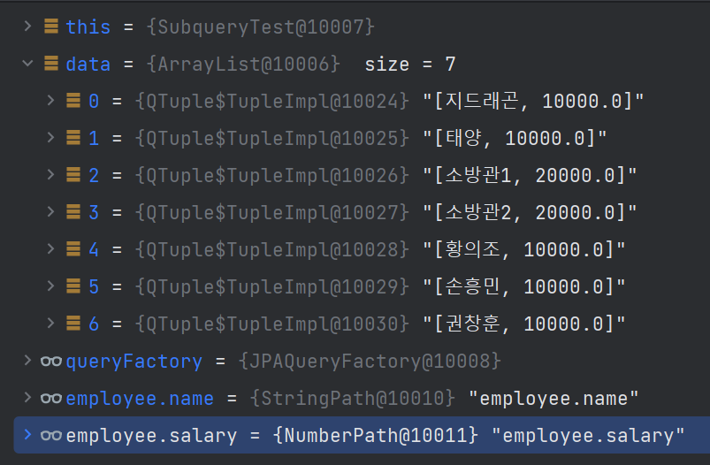

# Querydsl 의 프로젝션
{: .no_toc }

1 번 글인 Querydsl 빠르게 훑어보기 라는 글에서 Querydsl 이라는 게임기를 어떻게 돌리는지 예제들을 훑어봤다. <br>

이번 문서에서는 Querydsl 로 쿼리를 날려서 결과를 가져올때 원하는 컬럼만 객체로 어떻게 바인딩해서 가져오는지 정리.<br>
<br>
<br>
Spring Data 라는 디렉터리에서 정리하겠지만, 테스트 도구에 익숙해지면, 쿼리계층의 코드를 작성하는게 게임처럼 다이나믹하게 된다. 
<br>

테스트 환경을 잘 잡아두면 데이터 계층은 심오한 코드가 필요하지는 않지만, 즉시 쿼리를 날리고 결과를 확인하고 객체에 잘 바인딩되는지 확인하는 다이나믹한 프로그래밍을 할 수 있게 된다.
<br>

이건 Mybatis, JDBC Template 역시 테스트 환경에 익숙해지면 개발 자체가 게임처럼 역동적으로 할수 있게 된다.
<br>
<br>


## Table of contents
{: .no_toc .text-delta }

1. TOC
{:toc}

---

<br>

### 참고자료
{: .fs-6 .fw-700 }
[인프런 - 실전! Querydsl](https://www.inflearn.com/course/querydsl-%EC%8B%A4%EC%A0%84)
<br>
<br>


### 프로젝션이란?
{: .fs-6 .fw-700 }

SQL의 결과값을 어떤 객체에 반영(프로젝션)할지를 의미한다.<br>

e.g.
```java
QMember member = QMember.member;
List<String> result = queryFactory
  .select(member.username)
  .from(member)
  .fetch();
```
<br>

사원 명 `username` 만을 리스트로 출력하는 쿼리이다.<br>
<br>

만약 `username` 말고 `email` 도 함께 받아로려면?<br>
하나의 객체에 `username`, `email` 을 함께 묶어서 바인딩하면 된다. 이렇게 쿼리 결과를 하나의 객체에 반영하는 것을 Qeurydsl 에서는 **"프로젝션"**이라고 부른다.<br>
<br>

쿼리 결과를 객체에 매핑하는 것은 Mybatis 에도 있고, JDBCTemplate 에도 있는 개념이다. <br>
<br>
<br>

### 프로젝션에서의 자료형
{: .fs-6 .fw-700 }

보통 프로젝션을 한다고 할때 고려되는 자료형은 3가지이다.<br>

- String, Long, ... 등의 기본 래퍼(Wrapper) 클래스
- 튜플
  - Querydsl 에 특화된 자료형이다. Querydsl 라이브러리에 종속적인 자료형이기에 자주 사용되는 자료형은 아니다.
- Dto
  - 데이터의 반환형을 직접 정의해 반환하는 방식
  - 프리젠테이션 계층에 반환할 객체를 따로 정의하는 방식이다.
  - Entity와 같은 형식의 데이터는 도메인에 가깝기에 최대한 훼손시키지 않으면서, 화면 로직의 잦은 유지보수, 변경사항에 대응해 Dto로 바인딩하는 것은 어느 정도는 나름 대로 권장되는 방식이다.
<br>
<br>


### 1\) 기본 Wrapper 자료형 프로젝션 해보기
{: .fs-6 .fw-700 }

e.g. 단순 String 의 리스트를 출력해보기
```java
	List<Tuple> data = queryFactory
			.select(employee.name)
			.from(employee)
			.fetch();

	System.out.println(data);
```
<br>
<br>

### 2\) 튜플을 사용하는 방식
{: .fs-6 .fw-700 }
- 권장되지 않는 사용방식

```java
import com.querydsl.core.Tuple;

// ...

@Test
void 튜플사용해봅시다(){
	List<Tuple> data = queryFactory
			.select(employee.name, employee.salary)
			.from(employee)
			.fetch();

	System.out.println(data);
}
```
<br>

출력결과

<br>
<br>

### 3\) Dto 프로젝션
{: .fs-6 .fw-700 }

Dto에 기본 생성자를 반드시 추가해줘야 한다는 점을 꼭 주의해야한다. (기본생성자가 없으면 라이브러리 레벨에서 리팩토링 등을 이용해 객체를 생성할 수 없기 때문)
<br>
<br>

프로젝션 시에는 Projections 라는 Querydsl 클래스 내의 `bean()`, `fields()`, `constructor()` 메서드 중 하나를 선택해서 사용한다.
<br>

- Projections.bean(...)
  - 프로퍼티에 접근해서 Projection 하는 방식
  - e.g) `Projections.bean(MemberDto.class, member.username, member.age)`
- Projections.field(...)
  - 필드에 직접 접근해서 Projection 하는 방식
  - e.g) `Projections.fields(MemberDto.class, member.username, member.age)`
- Projections.constructor()
  - 생성자를 이용해 Projection 하는 방식
  - e.g) `Proejctions.constructor(MemberDto.class, member.username, member.age)`

<br>
흔히 의존성 주입을 이야기 할때 프로퍼티 주입, 필드 주입, 생성자 주입 방식을 이야기 하는데, querydsl 의 프로젝션은 위의 방식들에 대응되는 듯한 이름의 메서드들을 제공하고 있다는 점을 보자
<br>
<br>

#### Dto 프로젝션 (1) - Projections.bean 사용
{: .fs-5 .fw-700 }

- **querydsl의 Projections.bean(...)을 사용하는 방식**
- 자바 빈 규약 (Getter/Setter)를 활용한 방식이다.
- 반드시 DTO내에 기본 생성자(또는 롬복의 @NoArgsConstructor) 가 선언되어 있어야 동작한다.

```java
@Test
public void dtoProjectionBySetter(){
  QMember member = QMember.member;

  List<MemberDto> dtoList = queryFactory
    .select(
    Projections.bean(
      MemberDto.class,
      member.username,
      member.age
    )
  )
    .from(member)
    .fetch();

  for(MemberDto d : dtoList){
    System.out.println("data :: " + d);
  }
}
```
<br>
<br>

#### Dto 프로젝션 (2) - Projections.fields 사용방식
{: .fs-5 .fw-700 }

- **querydsl의 Projections.fields(...) 메서드를 사용하는 방식**
- DTO의 필드에 직접 접근하는 방식이다.
- DTO 멤버 필드의 private 멤버필드도 리플렉션을 쓰면 가져올 수 있다.
  즉, 내부적으로 리플렉션이 적용되어 있다.
- 반드시 DTO 클래스 내에 기본생성자(또는 @NoArgsConstructor)가 있어야 동작한다.
<br>

```java
@Test
public void dtoProjectionByField(){
  QMember member = QMember.member;

  List<MemberDto> dtoList = queryFactory
    .select(
    Projections.fields(
      MemberDto.class,
      member.username,
      member.age
    )
  )
    .from(member)
    .fetch();

  for(MemberDto d : dtoList){
    System.out.println("data :: " + d);
  }
}
```

#### Dto 프로젝션 (3) - Projections.constructor 사용방식
{: .fs-5 .fw-700 }

- **Projections.constructor(...) 메서드를 사용하는 방식**
- 반드시 DTO클래스 내에 기본 생성자(또는 @NoArgsConstructor)가 있어야 동작한다.
```java
@Test
public void dtoProjectionByConstructor(){
  QMember member = QMember.member;

  List<MemberDto> dtoList = queryFactory
    .select(
    Projections.constructor(
      MemberDto.class,
      member.username,
      member.age
    )
  )
    .from(member)
    .fetch();

  for(MemberDto d : dtoList){
    System.out.println("data :: " + d);
  }
}
```
<br>
<br>

### as - Dto 의 필드명과 쿼리에서 사용하는 컬럼명이 다를 경우 
{: .fs-6 .fw-700 }

```java
@Test
public void dtoProjectionAliasBasic(){
  QMember member = QMember.member;

  /** ex) member.username.as("name") */
  List<UserDto> aliasResult = queryFactory.select(
    Projections.fields(
      UserDto.class,
      member.username.as("name"),		// ExpressionUtils.as(member.username, "as") 와 같은 표현이다.
      member.age
    )
  ).from(member).fetch();

  /** 결과를 확인해보면 제대로 값이 들어와 있다.. */
  System.out.println("===== Alias Result =====");
  for(UserDto d : dtoList){
    System.out.println("data :: " + d);
  }
}
```

- Member 클래스의 username 필드 값을 UserDto 클래스의 name 필드로 매핑되게끔 지정해줬다.<br>
<br>
<br>

### (4\) 서브쿼리 프로젝션
{: .fs-6 .fw-700 }

```java
QMember member = QMember.member;
QMember subMember = new QMember("subMember");
```
<br>
<br>
서브쿼리를 사용하기 위해서는 별도의 QType 인스턴스를 하나 더 생성해서 멤버변수로 선언해야 한다. <br>
(인라인 뷰처럼 쿼리 안에서 또 다른 쿼리의 흐름을 만들어야 하므로 QType 인스턴스를 새로 하나 더 만든다고 이해하면 이해가 쉬울듯)<br>
<br>

서브쿼리를 사용하는 구문에서는 아래와 같이 ExpressionUtils 클래스와 JPAExpressions 클래스를 사용한다.
```java
List<UserDto> asResult = queryFactory.select(
	Projections.field(
		UserDto.class, 
		member.username.as("name"), "age",

		// 여기
		ExpressionUtils.as(
			JPAExpressions.select(subMember.age.max())
		)
		.from(subMember)
	)
)
.from(member)
.fetch();
```
<br>
<br>

### 참고) JPQL 에서의 Dto 프로젝션
{: .fs-6 .fw-700 }

패키지의 전체 경로를 포함한 클래스의 경로를 전달해줘야 한다.
```java
@Test
public void dtoProjectionByJPQL(){
  List<MemberDto> resultList = em
    .createQuery(
    "select new com.study.qdsl.dto.MemberDto(m.username, m.age) from Member m",
    MemberDto.class
  )
    .getResultList();

  for(MemberDto d : resultList){
    System.out.println("memberDto :: " + d);
  }
}
```
<br>
<br>


<br>
<br>

###  5\) Dto 프로젝션 - @QueryProjection


Querydsl 에 대한 확신이 있다면 QueryProjection 을 사용하는 것 역시 확실한 방법

e.g.
```java
import com.querydsl.core.annotations.QueryProjection;
import lombok.Data;
import lombok.NoArgsConstructor;
// ...
// ...
@Data 
@NoArgsConstructor
public class MemberDto {

	private String username;
	private int age;

  // 여기에 추가해주었다.
	@QueryProjection
	public MemberDto(String username, int age){
		this.username = username;
		this.age = age;
	}
}
```
<bR>


